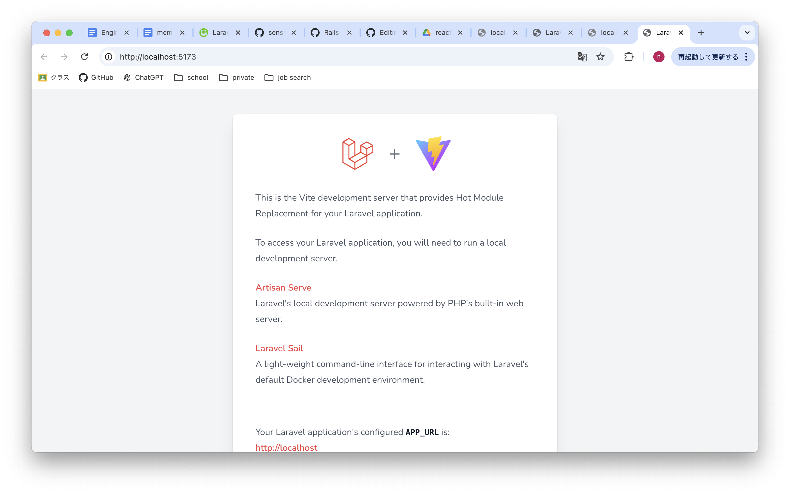

# Welcome to shift-management Web Application

## 使用技術一覧


## 事前準備

※`MAMP`上に`Laravel`プロジェクトが作成されており、DB設定などバックエンドの環境構築が終わっている状態を前提とします。


- [Node.js](https://nodejs.org/en/download/package-manager)をインストール

```sh
node -v
npm -v
```

- Reactを導入するために、Laravelプロジェクトに、Laravel UIパッケージを導入

```sh
composer require laravel/ui
```

- React を使ったフロントエンド UI をセットアップ
```sh
php artisan ui react --auth
```
>--authオプションをつけることで、Reactだけでなく、Laravel の認証機能（ログイン、登録、パスワードリセットなど）も同時にインストール

- npm を使って必要なフロントエンドの依存パッケージをインストール
```sh
npm install
```
- ローカル環境でデプロイする
```sh
npm run dev
```


>　停止しておく

- 確認
```
php artisan serve
```


